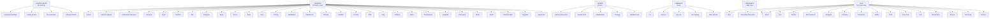

# GRAPH — engines as roots, channels as variations (v1)

```mermaid
graph TD
  E1[HOSTED-MUSIC<br/>the evening] --> C34[Composer Evenings]
  E1 --> C37[Sleepy Covers]
  E1 --> C49[Deconstructed]
  E1 --> CH[Classical Charts]
  E2[READING<br/>PD text to sleep] --> C1[Steiner]
  E2 --> C3a[Daimon readings]
  E2 --> C4a[Channeled read-aloud]
  E2 --> C8[Alchemy]
  E2 --> C9[Angel]
  E2 --> C10[Kashmir]
  E2 --> C13[Sufi]
  E2 --> C14[Dialogues]
  E2 --> C16[Saiva]
  E2 --> C17[Ficino]
  E2 --> C18[Spell]
  E2 --> C21[Tarot]
  E2 --> C22[I Ching]
  E2 --> C23[Meditations]
  E2 --> C24a[Spanda text]
  E2 --> C25[Plotinus]
  E2 --> C26[Buddha]
  E2 --> C32[Gnostic]
  E2 --> C36[Myth]
  E2 --> C41[Fairy]
  E2 --> C42[Folklore]
  E2 --> C43[Myth+]
  E2 --> C45[Cassiopaean]
  E2 --> C50[Kabbalah]
  E2 --> C51[Theosophy]
  E2 --> C52[Hindu]
  E2 --> C53[Taoist]
  E2 --> C54[Christian Myst]
  E2 --> C55[Egyptian]
  E2 --> C56[Manly Hall]
  E3[GUIDED<br/>picture...] --> C3b[Daimon encounters]
  E3 --> C24b[Spanda body]
  E3 --> C46[Manifestation]
  E3 --> C47[Theurgy]
  E3 --> C50b[Kabbalah tree]
  E4[AMBIENCE<br/>loops] --> C35[Fly]
  E4 --> C39[Anti war]
  E4 --> C40[Fly pure]
  E4 --> C48[Anti arguing]
  E4 --> RAIN[Rain variants]
  E5[TALK<br/>host discusses] --> C2[Near]
  E5 --> C4b[Channeled discussion]
  E5 --> C5[Soul]
  E5 --> C6[Genius]
  E5 --> C7[News]
  E5 --> C11[AGI Scenarios]
  E5 --> C12[Shoggoth]
  E5 --> C19[Company]
  E5 --> C20[Conspiracy]
  E5 --> C27[Maths]
  E5 --> C28[Truth]
  E5 --> C29[Cosy Past]
  E5 --> C30[Lore]
  E5 --> C31[Niche Psych]
  E5 --> C33[Snooze]
  E5 --> C38[AGI Sleep]
  E5 --> C44[School]
  E6[FRESHNESS<br/>daily scan] --> C7
```

Counts: E1·14 E2·32 E3·4 E4·4 E5·32 E6·1 (splits intentional — engines compose).
