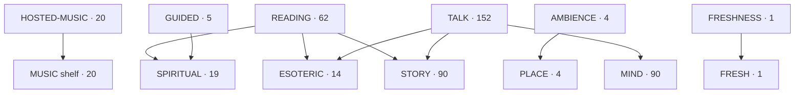

# GRAPH — engines as roots, channels as variations (v2, 2026-09-26)

238 nodes no longer fit a node map — engines and shelves are the graph now.
Full membership: registry/channels.yaml (validated). Detail maps per
engine live in SUBENGINES.md.

Counts: E1·20 E2·62 E3·5 E4·4 E5·152 E6·1. Shelves: Spiritual·19
Esoteric·14 Story·90 Mind·90 Music·20 Place·4 Fresh·1. Splits intentional.
